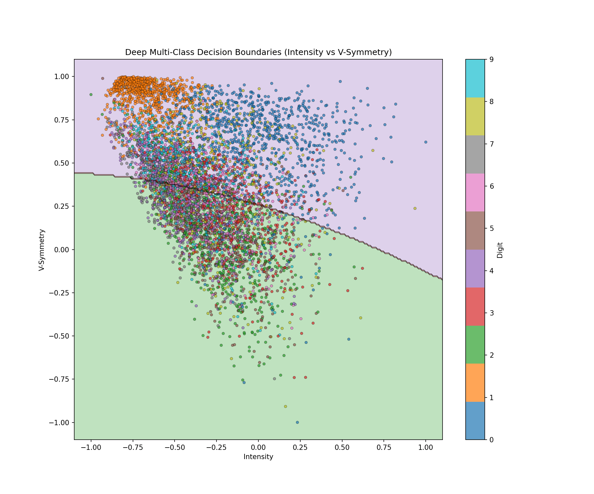
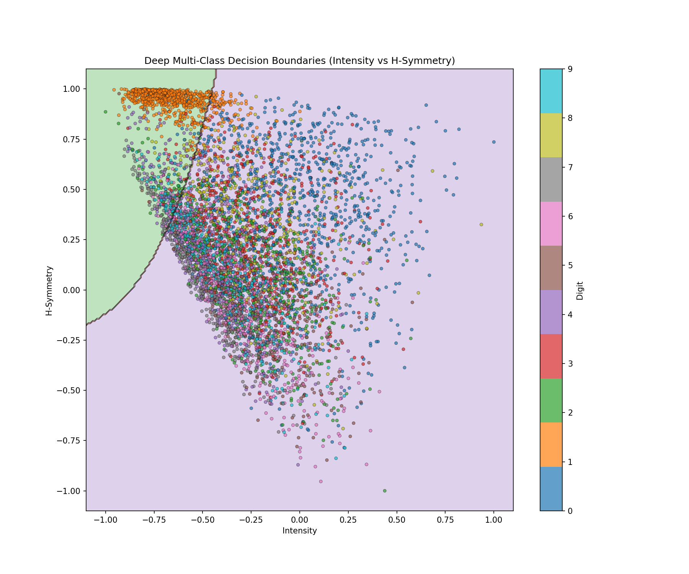
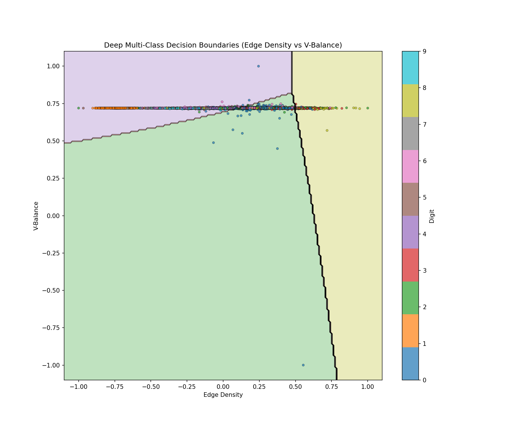

# Handwritten Digit Classifier

A neural network implementation **from scratch** (no TensorFlow/PyTorch) for recognizing handwritten digits (0-9) using the ZIP Digits dataset from the U.S. Postal Service.

## Project Structure

```
├── NeuralNetwork.py              # 2-layer neural network (from RPI ML course)
├── DeepNeuralNetwork.py          # 3-layer deep neural network extension
├── MultiClassClassifier.py       # One-vs-All classification wrapper
├── FeatureExtractor.py           # Feature engineering (284 features)
├── main.py                       # Unified training interface (CLI)
├── TrainEnhanced.py              # Quick training script
├── Test.py                       # Binary classification demo
├── PredictDigit.py               # Inference on new images
├── ZipDigits.train               # Training dataset (7,291 samples)
├── ZipDigits.test                # Test dataset (2,007 samples)
├── ZipDigits.info                # Dataset metadata
├── my_model.pkl                  # Trained model weights
├── my_model_importance.pkl       # Feature importance analysis
├── boundary_*.png                # Decision boundary visualizations (shallow)
├── deep_boundary_*.png           # Decision boundary visualizations (deep)
├── random_dataset_generator.py   # Generate random numbers for test datasets
├── SamplePhotos/                 # Sample handwritten images for testing
│   └── image1.jpeg - image12.jpeg
└── __pycache__/                  # Python bytecode cache
```

## Building on RPI Machine Learning Course

This project extends the final assignment from **Machine Learning From Data** at RPI. The original assignment required implementing a neural network entirely from scratch.

### Original Assignment Requirements

The course assignment required:
- Implementing a 2-layer neural network without ML libraries
- Forward propagation with tanh activation
- Backpropagation to compute gradients analytically
- Stochastic Gradient Descent (SGD) optimization
- Binary classification capability

The core implementation lives in `NeuralNetwork.py`.

### Extensions Beyond the Course

| Original Assignment | This Project Extension |
|---------------------|------------------------|
| 2-layer network | 3-layer deep network (`DeepNeuralNetwork.py`) |
| Basic features | 284 enhanced features (raw + handcrafted + pooled) |
| Binary classification | One-vs-All multi-class (10 digits) |
| Simple SGD | Early stopping, validation monitoring, L2 regularization |
| Single classifier | 10 classifier ensemble with confidence scores |
| — | Feature importance analysis |
| — | Production inference pipeline (image preprocessing) |
| — | Decision boundary visualization |

## How It Works

This project demonstrates a progression from a simple neural network to a full multi-class digit classifier:

### Step 1: Basic Neural Network (`NeuralNetwork.py`)

The foundation is a 2-layer neural network implemented from scratch:

```
Input (D features)
    ↓ [Weights W1]
Hidden Layer (M units, tanh activation)
    ↓ [Weights W2]
Output (1 unit)
```

**Training methods implemented:**
- Stochastic Gradient Descent (SGD)
- Variable/decaying learning rate
- L2 weight decay regularization
- Early stopping with validation monitoring

### Step 2: Binary Classification Demo (`Test.py`)

The simplest demonstration: classifying digit "1" vs all other digits.

- Extracts only 2 features: **intensity** (darkness) and **symmetry** (left-right mirror similarity)
- Trains a single neural network with 10 hidden units
- Visualizes the learned decision boundary

This shows how even simple features can separate digit classes.

### Step 3: Feature Engineering (`FeatureExtractor.py`)

For better accuracy, we extract 284 features from each 16×16 image:

**Hand-crafted features (12):**
| Feature | Description |
|---------|-------------|
| Intensity | Mean pixel value (overall darkness) |
| Vertical Symmetry | Left-right mirror similarity |
| Horizontal Symmetry | Top-bottom mirror similarity |
| Quadrant Intensities (4) | Mean intensity in each 8×8 quadrant |
| Edge Density | Count of pixel transitions (stroke complexity) |
| Vertical Balance | Top vs bottom intensity ratio |
| Center of Mass (2) | Weighted centroid coordinates |
| Hole Proxy | Center vs edge intensity ratio |

**Raw pixel features (256):** Normalized flattened 16×16 image

**Pooled features (16):** 4×4 average pooling of the image

### Step 4: Multi-Class Classification

To classify all 10 digits, we use the **One-vs-All** strategy:

- Train 10 separate binary classifiers (one per digit)
- Each classifier learns: "Is this digit X or not?"
- Final prediction: digit with highest confidence score

**Two implementations:**
- `MultiClassClassifier.py` - Uses 2-layer `NeuralNetwork`
- `DeepNeuralNetwork.py` - Uses deeper 3-layer architecture (128→32 hidden units)

### Step 5: Training

**Using `main.py`** (recommended):
```bash
python main.py --network deep --features enhanced --analyze --output my_model.pkl
```
- Full control over network architecture and hyperparameters
- Supports shallow (2-layer) or deep (3-layer) networks
- Saves trained model to specified output file

**Quick training** (`TrainEnhanced.py`):
- Uses all 284 features
- Deep network (128→32 hidden units)
- Good defaults for quick experimentation

### Step 6: Prediction (`PredictDigit.py`)

Use the trained model to predict digits from new images:

```
Input Image (any size)
    ↓
Preprocessing (grayscale, crop, resize to 16×16)
    ↓
Feature Extraction (284 features)
    ↓
Classification (10 binary classifiers)
    ↓
Predicted Digit (0-9) + Confidence Scores
```

## Results

### Performance

**Test Accuracy: 94.52%** (Training: 99.89% | Validation: 97.80%)

| Digit | Accuracy | Correct/Total |
|-------|----------|---------------|
| 0 | 98.1% | 352/359 |
| 1 | 97.0% | 256/264 |
| 2 | 93.4% | 185/198 |
| 3 | 89.8% | 149/166 |
| 4 | 94.0% | 188/200 |
| 5 | 91.9% | 147/160 |
| 6 | 94.7% | 161/170 |
| 7 | 91.8% | 135/147 |
| 8 | 91.6% | 152/166 |
| 9 | 97.2% | 172/177 |

<details>
<summary>View Confusion Matrix</summary>

```
        0    1    2    3    4    5    6    7    8    9
    --------------------------------------------------
 0 |  352    0    2    0    2    0    1    0    0    2
 1 |    0  256    0    2    2    0    3    0    1    0
 2 |    3    0  185    3    2    1    0    1    3    0
 3 |    1    0    3  149    0    8    0    1    2    2
 4 |    1    1    3    0  188    1    1    1    0    4
 5 |    4    0    0    4    0  147    0    0    1    4
 6 |    3    1    1    1    2    1  161    0    0    0
 7 |    0    0    1    2    6    0    0  135    1    2
 8 |    2    0    1    5    1    3    0    0  152    2
 9 |    0    0    1    0    2    1    0    1    0  172
```

</details>

<details>
<summary>Training Configuration</summary>

```bash
python main.py --network deep --features enhanced --analyze --output my_model.pkl
```

- **Network**: Deep (3-layer: 284 → 128 → 32 → 1)
- **Features**: Enhanced (284 dimensions)
- **Learning rate**: 0.005
- **Iterations**: 500,000 per classifier
- **Training samples**: 6,198 (after 15% validation split)
- **Validation samples**: 1,093
- **Test samples**: 2,007

</details>

### Decision Boundary Visualizations

The trained model learns complex decision boundaries to separate digit classes:

#### Intensity vs Vertical Symmetry


Digit "1" (orange, bottom-left) is clearly separated due to its low intensity and low symmetry.

#### Intensity vs Horizontal Symmetry


Different digits cluster based on whether they're symmetric (like "0", "8") or asymmetric (like "1", "7").

#### Edge Density vs Vertical Balance


Sharp, non-linear boundaries demonstrate the power of neural networks.

### Real-World Testing on Handwritten Samples

To test the model on real handwritten digits, 12 sample images were created in `SamplePhotos/`. Two numbers (67, 128) were personally selected, and 10 were randomly generated using `random_dataset_generator.py`.

| Image | Actual | Predicted | Correct? |
|-------|--------|-----------|----------|
| image1.jpeg | 67 | 67 | Yes |
| image2.jpeg | 128 | 128 | Yes |
| image3.jpeg | 31136 | 31136 | Yes |
| image4.jpeg | 39313 | 39313 | Yes |
| image5.jpeg | 74407 | 34407 | No |
| image6.jpeg | 8179 | 8179 | Yes |
| image7.jpeg | 9617 | 9617 | Yes |
| image8.jpeg | 61808 | 61808 | Yes |
| image9.jpeg | 61114 | 61114 | Yes |
| image10.jpeg | 79885 | 79882 | No |
| image11.jpeg | 69570 | 69570 | Yes |
| image12.jpeg | 1696 | 1696 | Yes |

**Results: 10/12 numbers correct (83.33%)**

#### Confidence Score Analysis

The model outputs confidence scores for each detected digit. These scores reveal important characteristics:

**Scores outside [0, 1] range:**
- Some confidence values exceed 1.0 (e.g., digit "4" in image5: 1.40)
- Some are negative (e.g., digit "3" in image3: -0.36, digit "5" in image11: -0.81)

This occurs because the neural network uses **tanh activation** and **identity output**, not a softmax layer. The raw output represents how strongly each binary classifier "votes" for its digit, not a true probability.

**Implications for future improvements:**
1. **Add softmax normalization** — Convert raw scores to proper probabilities in [0, 1]
2. **Implement confidence thresholding** — Reject predictions with low confidence scores
3. **Train on more diverse handwriting** — The ZIP Digits dataset contains postal service digits, which may differ from casual handwriting styles
4. **Data augmentation** — Add rotation, scaling, and noise to training data for better generalization

<details>
<summary>View detailed per-digit confidence scores</summary>

```
image1.jpeg  (67):     6 (0.93), 7 (0.88)
image2.jpeg  (128):    1 (0.96), 2 (?), 8 (0.85)
image3.jpeg  (31136):  3 (-0.36), 1 (1.01), 1 (1.00), 3 (?), 6 (1.01)
image4.jpeg  (74407):  3 (0.39), 9 (1.05), 3 (-0.14), 1 (?), 3 (0.98)
image5.jpeg  (39313):  3 (-0.03), 4 (1.40), 4 (?), 0 (-0.15), 7 (1.02)
image6.jpeg  (61114):  8 (-0.57), 1 (?), 7 (1.06), 9 (1.01)
image7.jpeg  (79885):  9 (0.98), 6 (1.03), 1 (?), 7 (1.00)
image8.jpeg  (61808):  6 (0.89), 1 (1.02), 8 (-0.11), 0 (?), 8 (0.22)
image9.jpeg  (8179):   6 (0.93), 1 (1.02), 1 (1.01), 1 (?), 4 (1.18)
image10.jpeg (9617):   7 (1.01), 9 (0.97), 8 (0.17), 8 (?), 2 (-0.13)
image11.jpeg (69570):  6 (0.99), 9 (0.62), 5 (-0.81), 7 (1.01), 0 (0.95)
image12.jpeg (1696):   1 (1.03), 6 (0.99), 9 (1.04), 6 (1.02)
```

</details>

## Installation & Usage

### Requirements

```bash
pip install numpy matplotlib pillow
```

### Train the Model

```bash
python main.py --network deep --features enhanced --analyze --output my_model.pkl
```

This will:
1. Load the ZIP Digits dataset
2. Extract 284 features from each image
3. Train 10 deep neural networks (one per digit)
4. Run feature importance analysis
5. Save the model to `my_model.pkl`
6. Generate decision boundary visualizations

**Quick training** (simpler script):
```bash
python TrainEnhanced.py
```

**CLI Options:**
| Option | Description |
|--------|-------------|
| `--network {shallow,deep}` | 2-layer or 3-layer architecture |
| `--features {basic,enhanced}` | 12 or 284 features |
| `--hidden N` or `--hidden N,M` | Custom hidden layer sizes |
| `--lr FLOAT` | Learning rate |
| `--iters INT` | Training iterations |
| `--analyze` | Run feature importance analysis |
| `--output FILE` | Model output filename |

### Predict on an Image

```bash
python PredictDigit.py path/to/your/image.jpg
```

### Test on Dataset Samples

```bash
python PredictDigit.py
```

This runs predictions on 10 random samples from the test set.

## Dataset

**ZIP Digits Dataset** (AT&T Research Labs / Yann LeCun)

- **Source:** U.S. Postal Service handwritten envelope digits
- **Format:** 16×16 grayscale images (256 pixel values)
- **Preprocessing:** Deslanted and size-normalized
- **Training samples:** 7,291
- **Test samples:** 2,007

| Digit | Train | Test |
|-------|-------|------|
| 0 | 1,194 | 359 |
| 1 | 1,005 | 264 |
| 2 | 731 | 198 |
| 3 | 658 | 166 |
| 4 | 652 | 200 |
| 5 | 556 | 160 |
| 6 | 664 | 170 |
| 7 | 645 | 147 |
| 8 | 542 | 166 |
| 9 | 644 | 177 |

## Key Highlights

- **From scratch:** No machine learning libraries - just NumPy for matrix operations
- **Complete pipeline:** From raw pixels to trained classifier
- **Feature engineering:** Demonstrates the importance of good features
- **Visualization:** See how neural networks learn decision boundaries
- **Modular design:** Easy to understand progression from simple to complex
